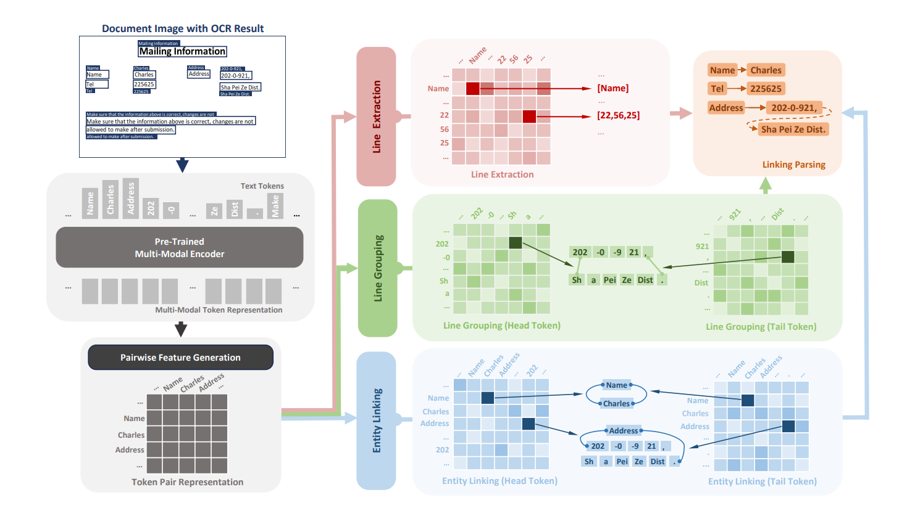

<h1>PEneo</h1>

<a href="https://arxiv.org/abs/2401.03472">
    </img>
</a>

This is an official implementation of PEneo introduced in the MM'2024 paper *PEneo: Unifying Line Extraction, Line Grouping, and Entity Linking for End-to-end Document Pair Extraction*.

The RFUND annotations proposed in this paper can be found at [SCUT-DLVCLab/RFUND](https://github.com/SCUT-DLVCLab/RFUND).

> Codes in this repository have undergone modifications from our original implementation to enhance its flexibility and usability. As a result, the model performance may vary slightly from the original implementation.


<h2>Table of Contents</h2>

- [Introduction](#introduction)
  - [Motivation](#motivation)
  - [Methodology](#methodology)
- [Setup](#setup)
  - [Installation](#installation)
  - [Dataset Preparation](#dataset-preparation)
    - [RFUND](#rfund)
    - [SIBR](#sibr)
  - [Backbone Preparation](#backbone-preparation)
    - [Supported Document-AI backbones](#supported-document-ai-backbones)
    - [Pre-trained Utils Generation](#pre-trained-utils-generation)
- [Fine-tuning](#fine-tuning)
  - [Pair Extraction on RFUND](#pair-extraction-on-rfund)
  - [Pair Extraction on SIBR](#pair-extraction-on-sibr)
- [Citation](#citation)
- [Acknowledgement](#acknowledgement)
- [Copyright](#copyright)


## Introduction

### Motivation

Document pair extraction is a vital step in analyzing form-like documents containing information organized as key-value pairs. It involves identifying the key and value entities, as well as their linking relationships from document images. Previous research has generally divided it into two document understanding tasks: semantic entity recognition (SER) and relation extraction (RE). The SER task involves extracting contents that belong to predefined categories. Most of the existing methods implement SER using BIO tagging, where tokens in the input text sequence are tagged as the beginning (B), inside (I), or outside (O) element for each entity. On the other hand, the RE task aims to identify relations between given entities. Previous works have typically employed a linking classification network for relation extraction: given the entities in the document, it first generates representations for all possible entity pairs and then applies binary classification to filter out the valid ones. Document pair extraction is usually achieved by serially concatenating the above two tasks (SER+RE).

Although achievements have been made in SER and RE, the existing SER+RE approach overlooks several issues. In previous settings, SER and RE are viewed as two distinct tasks that have inconsistent input/output forms and employ simplified evaluation metrics. For the SER task, entity-level OCR results are usually given, where text lines belonging to the same entity are aggregated and serialized in human reading order. The model categorizes each token based on the well-organized sequence, neglecting the impact of improper OCR outputs. In the RE task, models take the ground truths of the SER task as input, using prior knowledge of entity content and category. The model simply needs to predict the linkings based on the provided key and value entities, and the linking-level F1 score is taken as the evaluation metric. In real-world applications, however, the situation is considerably more complex. Commonly used OCR engines typically generate results at the line level. For entities with multiple lines, an extra line grouping step is required before BIO tagging, which is hard to realize for complex layout documents. Additionally, errors in SER predictions can significantly impact the RE step, resulting in unsatisfactory pair extraction results.


### Methodology

To address the above issues, we propose **PEneo** (**P**air **E**xtraction **n**ew d**e**coder **o**ption), integrating three downstream subtasks. The following figure depicts the architecture of PEneo:

<div align="center">

</div>

The line extraction head identifies the position of the desired key/value lines from the unordered input token sequence. The line grouping head aggregates text lines that belong to the same key/value entity. The entity linking head predicts the relations between key and value entities. The three heads are jointly optimized during the training phase. At the inference step, key-value pairs can be parsed by unifying the outputs of the three heads. 


## Setup

For quick start, you can follow the instructions below to set up the environment, prepare the dataset, generate pre-trained weights and configurations, and fine-tune the model on the RFUND and SIBR datasets.

For more detailed usage, please refer to the [documentation](docs/documentation.md).


### Installation

```bash
conda create -n vie python=3.10
conda activate vie
pip install torch==2.0.1 torchvision==0.15.2 torchaudio==2.0.2
pip install -r requirements.txt
```

If you want to use LayoutLMv2/LayoutXLM backbone, please additionally install detectron2:

```bash
pip install 'git+https://github.com/facebookresearch/detectron2.git'
```


### Dataset Preparation

#### RFUND

The RFUND annotations can be downloaded from [here](https://github.com/SCUT-DLVCLab/RFUND). Images of the dataset is available at the original release of [FUNSD](https://guillaumejaume.github.io/FUNSD/) and [XFUND](https://github.com/doc-analysis/XFUND/releases/tag/v1.0). The downloaded dataset should be organized as follows:

```bash
private_data
└── rfund
    ├── images
    │   ├── de
    │   ├── en
    │   ├── es
    │   ├── fr
    │   ├── it
    │   ├── ja
    │   ├── pt
    │   └── zh
    ├── de.train.json
    ├── de.val.json
    ├── en.train.json
    ├── en.val.json
    ├── es.train.json
    ├── es.val.json
    ├── fr.train.json
    ├── fr.val.json
    ├── it.train.json
    ├── it.val.json
    ├── ja.train.json
    ├── ja.val.json
    ├── pt.train.json
    ├── pt.val.json
    ├── zh.train.json
    └── zh.val.json
```

#### SIBR

We notice that some annotation errors exist in the original SIBR dataset (mainly due to the failure of data masking rules). To avoid potential issues, we made manual corrections and made the revised labels available [here](https://github.com/ZeningLin/PEneo/releases/tag/SIBR-revised-v1.0). Images of the dataset are available at the original release of [SIBR](https://www.modelscope.cn/datasets/iic/SIBR).

After downloading the original SIBR dataset and our revised labels, you should extract and place the revised `converted_label` folder under the root of the original SIBR directory. The dataset should be organized as follows:

```bash
private_data
└── sibr
    ├── converted_label # revised labels
    ├── images          # original images
    ├── label           # original labels
    ├── train.txt       # train split file
    └── test.txt        # test split file
```


### Backbone Preparation

#### Supported Document-AI backbones

<div align="center">

| Model Name              |  Link                                                                                        |
| ----------------------- | --------------------------------------------------------------------------------------------- |
| lilt-infoxlm-base       | 🤗 [SCUT-DLVCLab/lilt-infoxlm-base](https://huggingface.co/SCUT-DLVCLab/lilt-infoxlm-base)       |
| lilt-roberta-en-base    | 🤗 [SCUT-DLVCLab/lilt-roberta-en-base](https://huggingface.co/SCUT-DLVCLab/lilt-roberta-en-base) |
| layoutxlm-base          | 🤗 [microsoft/layoutxlm-base](https://huggingface.co/microsoft/layoutxlm-base)                   |
| layoutlmv2-base-uncased | 🤗 [microsoft/layoutlmv2-base-uncased](https://huggingface.co/microsoft/layoutlmv2-base-uncased) |
| layoutlmv3-base         | 🤗 [microsoft/layoutlmv3-base](https://huggingface.co/microsoft/layoutlmv3-base)                 |
| layoutlmv3-base-chinese | 🤗 [microsoft/layoutlmv3-base-chinese](https://huggingface.co/microsoft/layoutlmv3-base-chinese) |

</div>

#### Pre-trained Utils Generation

The pre-trained contents will be stored in the `private_pretrained` directory. Please create this folder before running the utils-generation scripts.

```bash
mkdir private_pretrained
```

If you want to use layoutlmv3-base as the model backbone, you can generate the required files by running the following command:


```bash
python tools/generate_peneo_weights.py \
  --backbone_name_or_path microsoft/layoutlmv3-base \
  --output_dir private_pretrained/layoutlmv3-base
```

The scripts will automatically download the pre-trained weights, tokenizer, and config files from 🤗Huggingface hub and convert them to the required format. Results will be stored in the `private_pretrained` directory. If you want to use other backbones, you can change the `--backbone_name_or_path` parameter to the corresponding HF model ID.

If the scripts fail to download the pre-trained files, you may manually download them through the links in the above table, and set the `--backbone_name_or_path` parameter to the local directory of the downloaded files.


## Fine-tuning

Checkpoints, terminal outputs, and tensorboard logs will be saved in `private_output/weights`, `private_output/logs`, and `private_output/runs`, respectively. Please create these directories before running the fine-tuning scripts.

```bash
mkdir -p private_output/weights
mkdir -p private_output/logs
mkdir -p private_output/runs
```

### Pair Extraction on RFUND

```bash
export PYTHONPATH=./
export CUDA_VISIBLE_DEVICES=0,1
export TRANSFORMERS_NO_ADVISORY_WARNINGS='true'
PROC_PER_NODE=$(python -c "import torch; print(torch.cuda.device_count())")
MASTER_PORT=11451

LANGUAGE=en
TASK_NAME=layoutlmv3-base_rfund_${LANGUAGE}
PRETRAINED_PATH=private_pretrained/layoutlmv3-base
DATA_DIR=private_data/rfund
OUTPUT_DIR=private_output/weights/$TASK_NAME
RUNS_DIR=private_output/runs/$TASK_NAME
LOG_DIR=private_output/logs/$TASK_NAME.log
torchrun --nproc_per_node $PROC_PER_NODE --master_port $MASTER_PORT start/run_rfund.py \
    --model_name_or_path $PRETRAINED_PATH \
    --data_dir $DATA_DIR \
    --language $LANGUAGE \
    --output_dir $OUTPUT_DIR \
    --do_train \
    --do_eval \
    --fp16 \
    --per_device_train_batch_size 4 \
    --per_device_eval_batch_size 16 \
    --dataloader_num_workers 8 \
    --warmup_ratio 0.1 \
    --learning_rate 5e-5 \
    --max_steps 25000 \
    --evaluation_strategy steps \
    --eval_steps 1000 \
    --save_strategy steps \
    --save_steps 1000 \
    --save_total_limit 1 \
    --logging_strategy epoch \
    --logging_dir $RUNS_DIR \
    --detail_eval True \
    --save_eval_detail True \
    2>&1 | tee -a $LOG_DIR
```

The above script uses `layoutlmv3-base` as the model backbone and fine-tunes the model on `RFUND-EN`. You may try different backbones and language subsets by changing the `PRETRAINED_PATH` and `LANGUAGE` accordingly. Different backbones require different hyper-parameters, so you may need to adjust the training arguments accordingly.


### Pair Extraction on SIBR

Similarly, you can fine-tune the model on the SIBR dataset by running the following script:

```bash
export PYTHONPATH=./
export CUDA_VISIBLE_DEVICES=0,1
export TRANSFORMERS_NO_ADVISORY_WARNINGS='true'
PROC_PER_NODE=$(python -c "import torch; print(torch.cuda.device_count())")
MASTER_PORT=11451

TASK_NAME=layoutlmv3-base-chinese_sibr
PRETRAINED_PATH=private_pretrained/layoutlmv3-base-chinese
DATA_DIR=private_data/sibr
OUTPUT_DIR=private_output/weights/$TASK_NAME
RUNS_DIR=private_output/runs/$TASK_NAME
LOG_DIR=private_output/logs/$TASK_NAME.log
torchrun --nproc_per_node $PROC_PER_NODE --master_port $MASTER_PORT start/run_sibr.py \
    --model_name_or_path $PRETRAINED_PATH \
    --data_dir $DATA_DIR \
    --output_dir $OUTPUT_DIR \
    --do_train \
    --do_eval \
    --fp16 \
    --per_device_train_batch_size 4 \
    --per_device_eval_batch_size 16 \
    --dataloader_num_workers 8 \
    --warmup_ratio 0.1 \
    --learning_rate 5e-5 \
    --max_steps 25000 \
    --load_best_model_at_end True \
    --metric_for_best_model f1 \
    --evaluation_strategy steps \
    --eval_steps 1000 \
    --save_strategy steps \
    --save_steps 1000 \
    --save_total_limit 3 \
    --logging_strategy epoch \
    --logging_dir $RUNS_DIR \
    --detail_eval True \
    --save_eval_detail True \
    2>&1 | tee -a $LOG_DIR
```

It is worth noting that the SIBR dataset is a Chinese-English bilingual dataset. You should use multi-lingual backbones like `layoutlmv3-base-chinese`, `lilt-infoxlm-base` and `layoutxlm-base` for fine-tuning.


## Citation

If you find PEneo helpful, please consider citing our paper:

```
@inproceedings{lin2024peneo,
  title={PEneo: Unifying Line Extraction, Line Grouping, and Entity Linking for End-to-end Document Pair Extraction},
  author={Lin, Zening and Wang, Jiapeng and Li, Teng and Liao, Wenhui and Huang, Dayi and Xiong, Longfei and Jin, Lianwen},
  booktitle={Proceedings of the 32nd ACM International Conference on Multimedia},
  year={2024}
}
```

## Acknowledgement

Part of the code is adapted from [LiLT](https://github.com/jpWang/LiLT), [LayoutLMv2/XLM](https://github.com/microsoft/unilm/tree/master/layoutlmft), [LayoutLMv3](https://github.com/microsoft/unilm/tree/master/layoutlmv3), and [TPLinker](https://github.com/131250208/TPlinker-joint-extraction). We sincerely thank the authors for their great work.


## Copyright

This repository can only be used for non-commercial research purposes. 

For commercial use, please contact Prof. Lianwen Jin (eelwjin@scut.edu.cn).

If you encounter any problems, please open an issue or contact Zening Lin (zening.lin@outlook.com).

Copyright 2024, Deep Learning and Vision Computing Lab ([HomePage](http://www.dlvc-lab.net/), [GitHub](https://github.com/SCUT-DLVCLab)), South China University of Technology.
